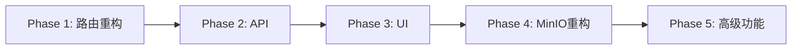

# Assets Browser 实现计划

## 概述
在 Mission Control 的 Workspace 内添加 Assets Tab，用于浏览和管理团队产出的资产文件（存储在 MinIO）。

## 目标
- 支持按工作流阶段分类浏览资产
- 支持 AI 追溯（查看资产来源 Agent/Task）
- 适用于各种类型的团队（软件、硬件、设计、研究等）
- 保持现有设计风格一致性

---

## Phase 1: 路由重构 + Tab 导航 (Priority: P0) ✅ 完成

### 1.1 创建 Workspace Layout
- [x] `src/app/workspace/[slug]/layout.tsx` - Workspace 壳组件
- [x] 抽取 `WorkspaceShell` 组件（数据加载 + SSE）
- [x] 添加 Tab 导航组件 `WorkspaceTabs.tsx`

**Tab 结构:**
```
/workspace/[slug]        → 重定向到 /board
/workspace/[slug]/board  → 任务看板（现有内容）
/workspace/[slug]/assets → 资产浏览器（新增）
```

### 1.2 迁移现有内容
- [x] 将 `page.tsx` 内容迁移到 `board/page.tsx`
- [x] 更新导入路径

**完成时间:** 2026-02-05

---

## Phase 2: 类型定义 + API (Priority: P0) ✅ 完成

### 2.1 类型定义
- [x] `src/lib/types.ts` - 新增 AssetStage, AssetType, Asset, AssetListResponse

### 2.2 MinIO API 路由
- [x] `src/app/api/assets/route.ts` - 列出资产
- [x] `src/app/api/assets/presign/route.ts` - 生成预签名 URL
- [x] `src/lib/minio.ts` - MinIO 客户端封装

**API 端点:**
```
GET  /api/assets?workspace_id=xxx&stage=planning
GET  /api/assets/presign?path=xxx&workspace_id=xxx
```

### 2.3 环境变量
- [x] `.env.example` 已更新

```env
MINIO_ENDPOINT=minio-production-e654.up.railway.app
MINIO_ACCESS_KEY=admin
MINIO_SECRET_KEY=xxx
MINIO_BUCKET=team-assets
MINIO_USE_SSL=true
```

**完成时间:** 2026-02-05

---

## Phase 3: Assets Browser UI (Priority: P0) ✅ 完成

### 3.1 核心组件
- [x] `src/components/assets/AssetsBrowser.tsx` - 主容器
- [x] `src/components/assets/AssetSidebar.tsx` - 左侧分类导航
- [x] `src/components/assets/AssetList.tsx` - 文件列表
- [x] `src/components/assets/AssetPreview.tsx` - 预览面板
- [x] `src/components/assets/index.ts` - 导出

### 3.2 功能特性
- 按 Stage 筛选（All/Planning/Design/Build/Review/Deliver）
- 按 Type 筛选（多选）
- 网格视图文件列表
- 图片预览支持
- 下载功能（presigned URL）
- 元数据展示（Stage, Type, Size, Created, Agent, Task）

**完成时间:** 2026-02-05

---

## Phase 4: MinIO 路径重构 (Priority: P1)

### 4.1 新路径结构
```
team-assets/
└── workspaces/
    └── {workspaceId}/
        ├── planning/    # PRD, 计划, 需求
        ├── design/      # 设计稿, 架构图
        ├── build/       # CAD, 代码, 产物
        ├── review/      # 评审报告
        └── deliver/     # 最终交付物
```

### 4.2 更新同步脚本
- [ ] 修改 `platform/infra/sync-minio.sh`
- [ ] 添加 workspaceId 参数支持
- [ ] 迁移现有文件到新路径

**预计工时:** 1-2h

---

## Phase 5: 高级功能 (Priority: P2)

### 5.1 上传功能
- [ ] 支持手动上传资产
- [ ] 自动识别文件类型和阶段

### 5.2 3D 预览
- [ ] 集成 three.js / @react-three/fiber
- [ ] 支持 GLB/GLTF 预览

### 5.3 搜索和过滤
- [ ] 全文搜索
- [ ] 按 Agent/Task 过滤
- [ ] 时间范围筛选

**预计工时:** 4-6h

---

## 文件清单

### 新增文件
```
src/app/workspace/[slug]/layout.tsx          # Workspace 布局
src/app/workspace/[slug]/board/page.tsx      # 任务看板（从 page.tsx 迁移）
src/app/workspace/[slug]/assets/page.tsx     # 资产浏览器页面
src/app/api/assets/route.ts                  # 资产列表 API
src/app/api/assets/presign/route.ts          # 预签名 URL API
src/components/assets/AssetsBrowser.tsx      # 主容器
src/components/assets/AssetSidebar.tsx       # 侧边栏
src/components/assets/AssetList.tsx          # 文件列表
src/components/assets/AssetPreview.tsx       # 预览面板
src/components/WorkspaceTabs.tsx             # Tab 导航
src/lib/minio.ts                             # MinIO 客户端封装
```

### 修改文件
```
src/lib/types.ts                             # 新增 Asset 类型
.env.example                                 # 新增 MinIO 配置
```

---

## 依赖安装
```bash
cd apps/mission-control
pnpm add minio
pnpm add -D @types/minio  # 如果需要
```

---

## 执行顺序



**总预计工时:** 8-12h (Phase 1-4)

---

## 验证清单

- [ ] Tab 切换正常工作
- [ ] 资产列表正确显示
- [ ] 按阶段筛选生效
- [ ] 预览功能正常
- [ ] AI 追溯信息显示
- [ ] 响应式布局适配
- [ ] 保持现有设计风格一致
